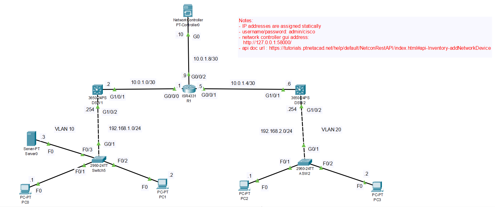

# Cisco Network Controller REST API Automation

## What This Project Does

This project demonstrates how network devices can be monitored and configured through a Cisco network controller REST API instead of performing every operation manually through the device CLI.

The project uses a Python client to:

- Authenticate with the controller
- Retrieve network device information
- Check network health and host status
- Retrieve controller services
- Update network services such as NTP, DNS, and Syslog
- Add network devices through the REST API

The network is simulated using Cisco Packet Tracer.

## Lab Topology

The Packet Tracer lab represents a small routed network managed through a Cisco network controller. The controller uses `10.0.1.10` as its network address and is connected to an ISR4331 router. The router provides connectivity between two 3650 distribution switches and their access-layer networks.



The left side of the topology uses VLAN 10 with the `192.168.1.0/24` network. The right side uses VLAN 20 with the `192.168.2.0/24` network. End devices and a server connect through access switches, while the routed links between the router and distribution switches use the `10.0.1.0/30` and `10.0.1.4/30` networks.

The controller uses 10.0.1.10 as its network address in the Packet Tracer topology. The REST API used by the Python client is exposed locally at http://127.0.0.1:58000

## Features

The client provides a simple terminal menu for working with the controller API. It first authenticates with `/api/v1/ticket`, then reads the returned `response.serviceTicket` value and sends it as the `X-Auth-Token` header for later API requests.

Using the menu, you can retrieve network-device information, controller services, network health, and host status. Host requests can also include optional filters such as limit, offset, IP address, MAC address, and hostname.

The client updates network service configuration including NTP, DNS, and Syslog through the controller REST API. Service templates in `config.json` provide the request fields, allowing you to update one field at a time without manually building the complete request body. You can also add a network device by entering its API JSON payload in the console.

## Project Structure

```text
Cisco_Network_Controller_Automation/
├── Cisco_Network_Controller_Automation.pkt          
├── .env          # Controller username and password
├── .gitignore
├── config.json   # Controller URL, timeout, and service templates
├── README.md
├── requirements.txt
├── Topology.png
└── src/
		└── client.py # API client and console menu
```

## Requirements

- Python 3.9 or newer
- A reachable Cisco network controller
- Valid controller credentials

Install the dependencies from the project folder:

```powershell
pip install -r requirements.txt
```

## Configuration

Set the controller credentials in `.env`:

```env
SDN_USERNAME=admin
SDN_PASSWORD=your-password
```

Configure the controller connection in `config.json`:

```json
{
	"base_url": "http://127.0.0.1:58000",
	"timeout": 15,
	"verify_tls": true
}
```

Service update templates and their default values are also stored in `config.json`. The console lets you select a service and update one field without writing the request body manually.

Do not commit `.env` or expose controller credentials in a public repository.

## Run

From the project folder:

```powershell
python src/client.py
```

The menu provides these operations:

```text
1. Get Network Device Status
2. Get Services
3. Get Network Health
4. Get Hosts Status
5. Update Service
6. Add Network Device
```

For host status, press Enter to retrieve all hosts or provide optional filters as JSON:

```json
{"limit":"10","offset":"0","hostIp":"192.168.1.10"}
```

For adding a device, enter the JSON payload required by your controller, for example:

```json
{"ipAddress":"192.168.1.10"}
```
## API Development and Testing

The REST API was initially explored and tested using Postman.

Postman was used to:

- Authenticate with the controller
- Inspect API responses
- Test GET requests
- Test service configuration updates
- Test network-device creation

The Python client then implements the same API workflow programmatically.

## API Operations

| Console option | Method | Endpoint |
| --- | --- | --- |
| Get network device status | `GET` | `/api/v1/network-device` |
| Get services | `GET` | `/api/v1/wan/network-wide-setting` |
| Get network health | `GET` | `/api/v1/network-health` |
| Get hosts status | `GET` | `/api/v1/host` |
| Update service | `PUT` | `/api/v1/wan/network-wide-setting` |
| Add network device | `POST` | `/api/v1/network-device` |

## Authentication Flow

1. The client sends the username and password to `/api/v1/ticket`.
2. The controller returns a response containing `response.serviceTicket`.
3. The client stores that ticket in the session as `X-Auth-Token`.
4. All device, service, health, host, update, and add-device requests reuse that token.
